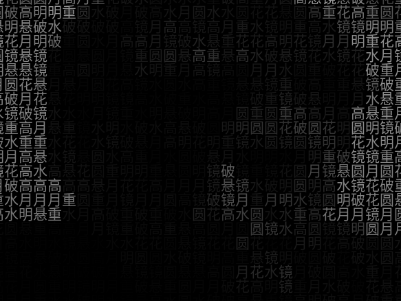
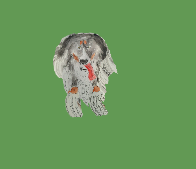
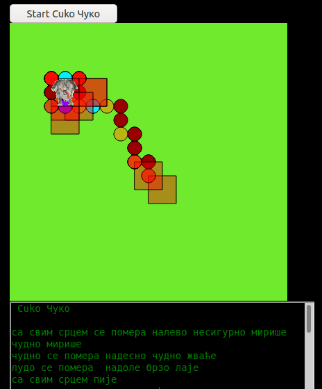

# Greg Kreisman and Marijana Crnic

Gregory Kreisman, edukator, američkog porekla, koji živi i radi u Pekingu, pohađa časove kaligrafije i kineskog tradicionalnog slikarstva. Neočekovano dugo je ostao u našem Gradu. 

Kao slikar - amater, inspiraciju za svoje slike, dobio je boraveći u Sremskoj Mitrovici, sa željom da svoja dela podeli kroz svoje viđenje, sad već i sa svojim sugrađanima.

Code 

[Character Mirror](https://editor.p5js.org/greggelong/present/8JH7JMbxC)

[Cuko running](https://editor.p5js.org/greggelong/present/n9dLxS-cW)

[Cuko speaking Serbian](https://editor.p5js.org/greggelong/present/haExP3yi4)

[Greg Kreisman website](https://greggelong.github.io/)
