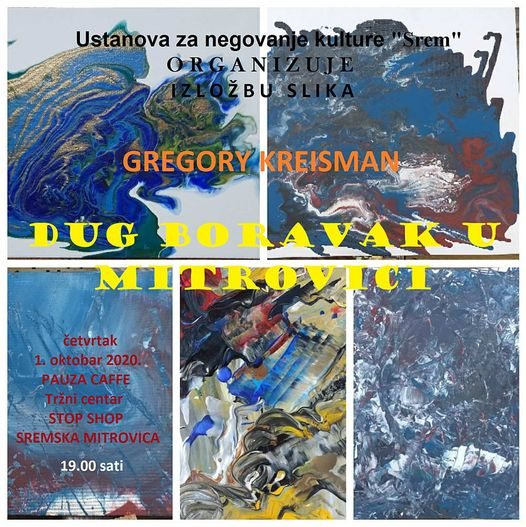

# Greg Kreisman and Marijana Crnic

Marijana je iz Srbije iz Srema tačnije, a Greg iz Amerike i zajedno se bave kaligrafijom i kineskim tradicionalnim slikarstvom u Pekingu gde žive i rade, a dela koja će nama predstaviti su dela u stilu kineske kaligrafije, akrilika, apstrakcije i blok printova.

Marijana i Greg izložiće svoje radove u Kafe Pauzi u Sremskoj Mitrovici
01.10. od 19h do 23h. 

Code 

[Character Mirror](https://editor.p5js.org/greggelong/present/8JH7JMbxC)

[Cuko running](https://editor.p5js.org/greggelong/present/n9dLxS-cW)

[Cuko speaking Serbian](https://editor.p5js.org/greggelong/present/haExP3yi4)

[Greg Kreisman website](https://greggelong.github.io/)
